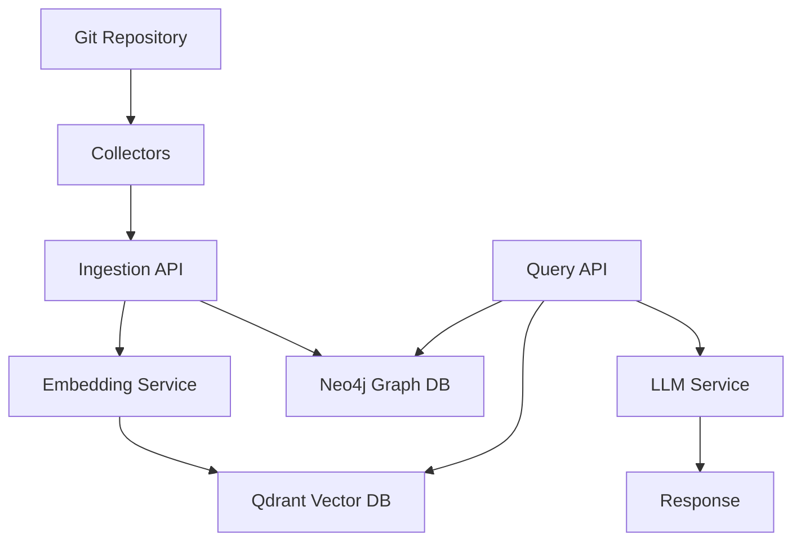

# Context Keeper 🧠

> **AI Memory Layer for Development Teams** - Never lose context again

[](https://www.python.org/downloads/)
[](https://fastapi.tiangolo.com/)
[](https://www.docker.com/)
[](LICENSE)

## 🎯 What is Context Keeper?

Context Keeper captures, indexes, and makes queryable ALL your development context - creating a searchable memory of your entire project's evolution. Ask questions in natural language and get intelligent answers about your codebase history.

### ✨ Key Features

- 🔍 **Semantic Search** - Query your codebase using natural language
- 📚 **Automatic Git Integration** - Indexes your entire commit history
- 🧠 **Vector Embeddings** - Uses sentence-transformers for intelligent matching
- 🤖 **Local LLM Support** - Privacy-first with Ollama integration
- 📊 **Knowledge Graph** - Neo4j tracks relationships between code changes
- ⚡ **Real-time Ingestion** - Captures context as you work
- 🎨 **Timeline Visualization** - See your development history at a glance

## 🚀 Quick Start

### Prerequisites

- Python 3.9+
- Docker & Docker Compose
- Git

### Installation

1. **Clone the repository**
```bash
git clone https://github.com/Naveen-babu1/context-keeper
cd context-keeper
```

2. **Start Docker services**
```bash
cd docker
docker-compose up -d
```

3. **Set up Python environment**
```bash
cd backend
python -m venv venv
source venv/bin/activate  # On Windows: venv\Scripts\activate
pip install -r requirements.txt
```

4. **Run the API server**
```bash
python app/main.py
```

5. **Ingest your git history**
```bash
cd ../collectors/git
python git_collector.py --repo /path/to/your/project --history 100
```

6. **Query your codebase!**
```bash
curl -X POST http://localhost:8000/api/query \
  -H "Content-Type: application/json" \
  -d '{"query": "What changes were made to authentication?"}'
```

## 📖 Usage Examples

### Query Your Development History

```python
# What features were added last week?
# Why did we refactor the database module?
# Who worked on the authentication system?
# What bugs were fixed in version 2.0?
```

### API Endpoints

- `POST /api/ingest/git` - Ingest git commits
- `POST /api/query` - Natural language search
- `GET /api/timeline` - View chronological events
- `GET /api/stats` - System statistics
- `GET /docs` - Interactive API documentation

## 🏗️ Architecture



### Tech Stack

- **Backend**: FastAPI, Python 3.9+
- **Vector Database**: Qdrant
- **Graph Database**: Neo4j
- **Embeddings**: Sentence Transformers
- **LLM**: Ollama (Mistral/Llama)
- **Cache**: Redis
- **Container**: Docker

## 🔧 Configuration

Create a `.env` file in the backend directory:

```env
# Databases
QDRANT_HOST=localhost
QDRANT_PORT=6333
NEO4J_URI=bolt://localhost:7687
NEO4J_PASSWORD=contextkeeper2024

# Models
EMBEDDING_MODEL=sentence-transformers/all-MiniLM-L6-v2
OLLAMA_MODEL=mistral:7b-instruct
```

## 📊 How It Works

1. **Capture**: Automatically ingests git commits, code changes, and development events
2. **Embed**: Converts text to vector embeddings using sentence-transformers
3. **Store**: Saves vectors in Qdrant and relationships in Neo4j
4. **Search**: Uses semantic similarity to find relevant context
5. **Answer**: Leverages LLM to provide intelligent responses

## 🤝 Contributing

Contributions are welcome! Please feel free to submit a Pull Request.

1. Fork the repository
2. Create your feature branch (`git checkout -b feature/AmazingFeature`)
3. Commit your changes (`git commit -m 'Add some AmazingFeature'`)
4. Push to the branch (`git push origin feature/AmazingFeature`)
5. Open a Pull Request

## 🚧 Roadmap

- [ ] Web UI Dashboard (Next.js)
- [ ] VS Code Extension
- [ ] Slack/Discord Integration
- [ ] Real-time collaborative features
- [ ] Custom embedding fine-tuning
- [ ] Export analytics and insights

## 📝 License

This project is licensed under the MIT License - see the [LICENSE](LICENSE) file for details.

## 🙏 Acknowledgments

- Inspired by the need to never lose context in complex projects
- Built with modern AI/ML technologies
- Designed for developers, by developers

## 📧 Contact

Project Link: [https://github.com/Naveen-babu1/context-keeper](https://github.com/Naveen-babu1/context-keeper)

---

**⭐ If you find Context Keeper useful, please star this repository!**